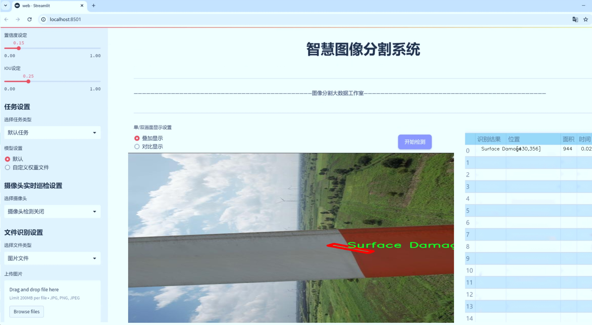
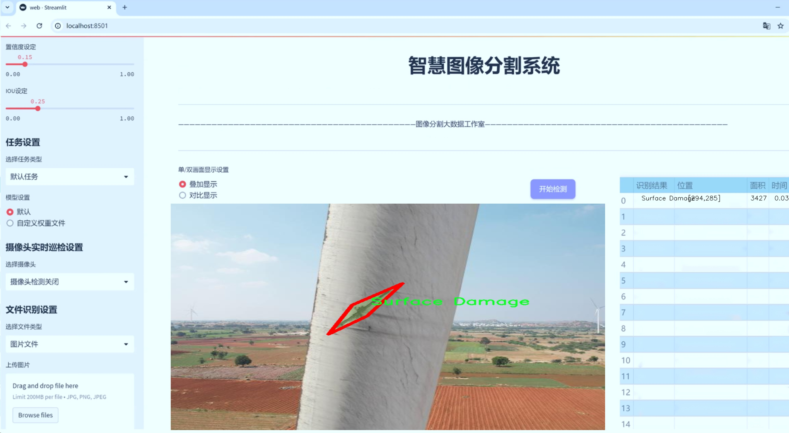
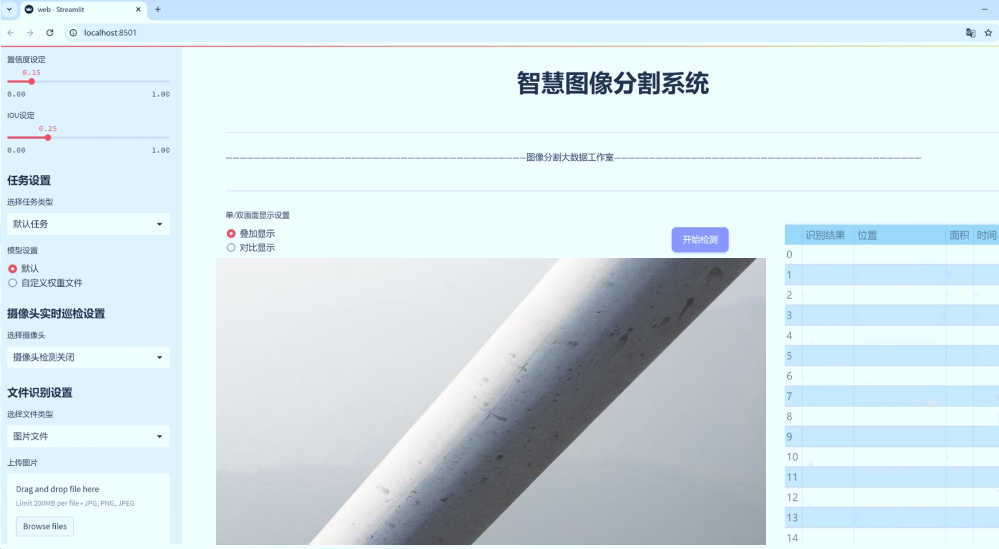
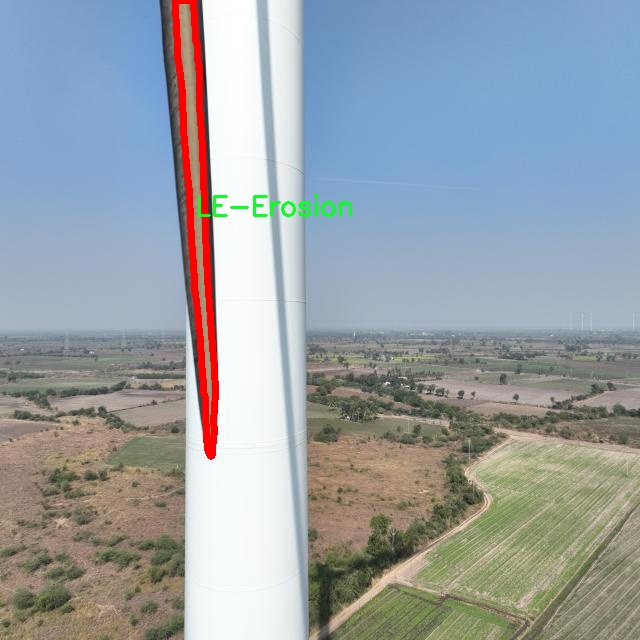
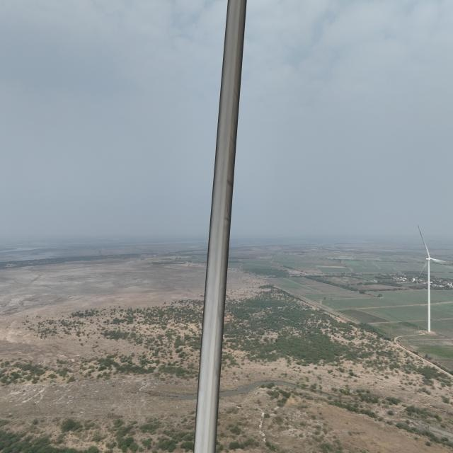
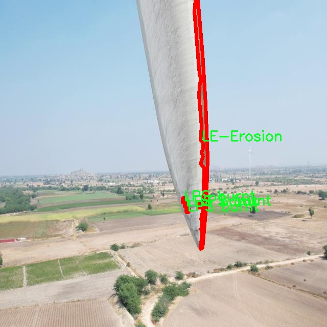
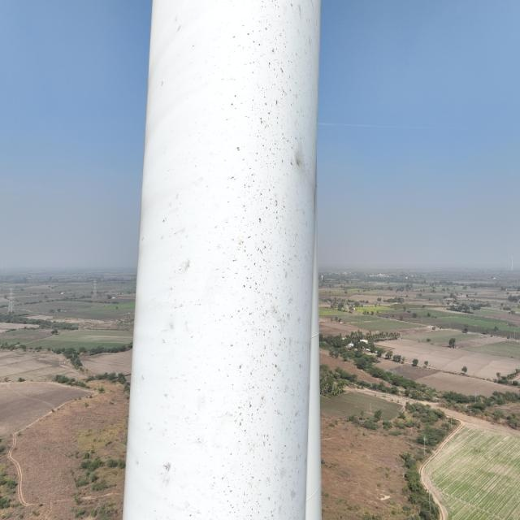
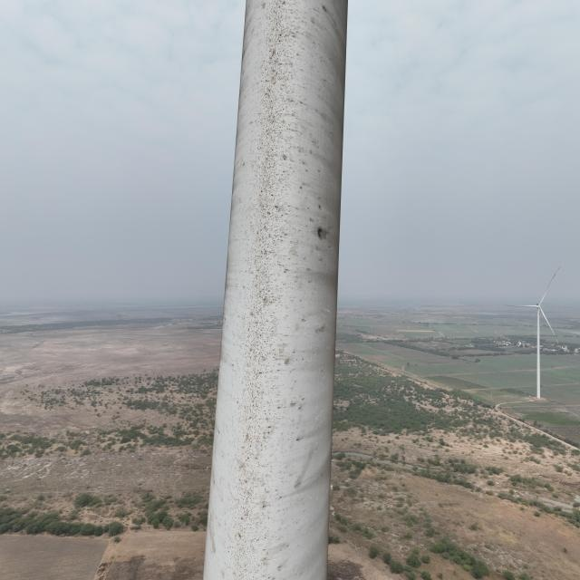

# 风力发电机外表面缺陷识别图像分割系统源码＆数据集分享
 [yolov8-seg-C2f-Parc＆yolov8-seg-dyhead等50+全套改进创新点发刊_一键训练教程_Web前端展示]

### 1.研究背景与意义

项目参考[ILSVRC ImageNet Large Scale Visual Recognition Challenge](https://gitee.com/YOLOv8_YOLOv11_Segmentation_Studio/projects)

项目来源[AAAI Global Al lnnovation Contest](https://kdocs.cn/l/cszuIiCKVNis)

研究背景与意义

随着全球对可再生能源的重视，风力发电作为一种清洁、高效的能源形式，得到了广泛的应用和发展。风力发电机作为风力发电系统的核心设备，其外表面状态直接影响到发电效率和设备的使用寿命。因此，及时、准确地识别和处理风力发电机外表面的缺陷，成为保障风力发电系统稳定运行的重要环节。然而，传统的人工检测方法不仅耗时耗力，而且容易受到人为因素的影响，导致漏检和误检现象频发。因此，开发一种高效、自动化的缺陷识别系统显得尤为重要。

近年来，深度学习技术的迅猛发展为图像处理领域带来了新的机遇。YOLO（You Only Look Once）系列模型以其高效的实时目标检测能力，逐渐成为计算机视觉领域的研究热点。特别是YOLOv8的推出，进一步提升了目标检测和图像分割的精度和速度，使其在工业缺陷检测中展现出良好的应用前景。通过对YOLOv8进行改进，结合实例分割技术，可以实现对风力发电机外表面缺陷的精准识别和定位，从而提高检测效率，降低维护成本。

本研究基于改进YOLOv8的风力发电机外表面缺陷识别图像分割系统，利用包含8100张图像的数据集，涵盖了五类缺陷：LE-Erosion（边缘侵蚀）、LPS burnt（局部烧损）、Oil Leakage（油漏）、Paint Peel Off（油漆剥落）和Surface Damage（表面损伤）。这些缺陷的存在不仅影响风力发电机的外观，更可能导致设备的功能障碍和安全隐患。因此，准确识别这些缺陷，对于风力发电机的维护和管理具有重要的实际意义。

通过对该数据集的深入分析和模型训练，研究将探索如何优化YOLOv8的参数设置，以提高对不同类型缺陷的识别精度。此外，实例分割技术的引入，将使得模型不仅能够识别缺陷的存在，还能精确划分缺陷的区域，为后续的维护决策提供可靠依据。这种方法的有效性和实用性，将为风力发电行业的智能化发展提供新的解决方案。

综上所述，本研究不仅具有重要的理论价值，还具备显著的实际应用意义。通过改进YOLOv8的图像分割系统，能够实现对风力发电机外表面缺陷的高效识别，为设备的安全运行和维护提供强有力的技术支持。这将推动风力发电行业向智能化、自动化的方向发展，助力可再生能源的可持续利用，具有广泛的社会和经济效益。

### 2.图片演示







##### 注意：由于此博客编辑较早，上面“2.图片演示”和“3.视频演示”展示的系统图片或者视频可能为老版本，新版本在老版本的基础上升级如下：（实际效果以升级的新版本为准）

  （1）适配了YOLOV8的“目标检测”模型和“实例分割”模型，通过加载相应的权重（.pt）文件即可自适应加载模型。

  （2）支持“图片识别”、“视频识别”、“摄像头实时识别”三种识别模式。

  （3）支持“图片识别”、“视频识别”、“摄像头实时识别”三种识别结果保存导出，解决手动导出（容易卡顿出现爆内存）存在的问题，识别完自动保存结果并导出到tempDir中。

  （4）支持Web前端系统中的标题、背景图等自定义修改，后面提供修改教程。

  另外本项目提供训练的数据集和训练教程,暂不提供权重文件（best.pt）,需要您按照教程进行训练后实现图片演示和Web前端界面演示的效果。

### 3.视频演示

[3.1 视频演示](https://www.bilibili.com/video/BV12R2BYkEb2/)

### 4.数据集信息展示

##### 4.1 本项目数据集详细数据（类别数＆类别名）

nc: 5
names: ['LE-Erosion', 'LPS burnt', 'Oil Leakage', 'Paint Peel Off', 'Surface Damage']


##### 4.2 本项目数据集信息介绍

数据集信息展示

在风力发电机的维护与管理中，外表面缺陷的及时识别与处理至关重要。为此，我们构建了一个专门用于训练改进YOLOv8-seg的风力发电机外表面缺陷识别图像分割系统的数据集，命名为“Less number of classes”。该数据集的设计旨在提供一个高效且精准的训练基础，以提升模型在实际应用中的表现。数据集的类别数量设定为5，涵盖了风力发电机外表面可能出现的主要缺陷类型，具体包括：LE-Erosion（边缘侵蚀）、LPS burnt（涂层烧毁）、Oil Leakage（油渗漏）、Paint Peel Off（油漆剥落）和Surface Damage（表面损伤）。

在数据集的构建过程中，我们精心挑选了多种风力发电机外表面缺陷的图像，以确保每个类别的样本具有足够的多样性和代表性。每一类缺陷的图像均来自于真实的风力发电机，涵盖了不同的环境条件和光照变化。这种多样性不仅提高了模型的泛化能力，还增强了其在复杂场景下的识别准确性。通过对每个类别进行细致的标注，我们确保了数据集的高质量，使得模型在训练过程中能够学习到每种缺陷的独特特征。

在数据集的使用中，YOLOv8-seg模型将通过对图像进行分割，精确识别出风力发电机表面的缺陷区域。通过将“Less number of classes”数据集与YOLOv8-seg相结合，我们期望能够实现高效的缺陷检测与定位。这一过程不仅包括对缺陷类型的分类，还涉及到对缺陷位置的精确标定，从而为后续的维护决策提供有力支持。

此外，数据集的设计还考虑到了训练效率与模型性能之间的平衡。通过限制类别数量，我们减少了模型在训练过程中的复杂性，使其能够更专注于每一类缺陷的特征学习。这种方法不仅提高了训练速度，还有效降低了过拟合的风险，从而使得模型在面对未知数据时，依然能够保持较高的识别率。

在实际应用中，经过训练的YOLOv8-seg模型将能够快速、准确地识别出风力发电机外表面存在的各种缺陷，帮助运维人员及时发现潜在问题，制定相应的维护措施。这不仅能够延长风力发电机的使用寿命，还能提高其运行效率，降低维护成本。

综上所述，“Less number of classes”数据集为改进YOLOv8-seg的风力发电机外表面缺陷识别图像分割系统提供了坚实的基础。通过高质量的图像样本和精确的标注，该数据集不仅为模型的训练提供了丰富的素材，也为风力发电机的安全运行与维护管理开辟了新的路径。随着技术的不断进步，我们期待这一系统能够在实际应用中发挥更大的作用，为可再生能源的可持续发展贡献力量。











### 5.全套项目环境部署视频教程（零基础手把手教学）

[5.1 环境部署教程链接（零基础手把手教学）](https://www.bilibili.com/video/BV1jG4Ve4E9t/?vd_source=bc9aec86d164b67a7004b996143742dc)


[5.2 安装Python虚拟环境创建和依赖库安装视频教程链接（零基础手把手教学）](https://www.bilibili.com/video/BV1nA4VeYEze/?vd_source=bc9aec86d164b67a7004b996143742dc)

### 6.手把手YOLOV8-seg训练视频教程（零基础小白有手就能学会）

[6.1 手把手YOLOV8-seg训练视频教程（零基础小白有手就能学会）](https://www.bilibili.com/video/BV1cA4VeYETe/?vd_source=bc9aec86d164b67a7004b996143742dc)


按照上面的训练视频教程链接加载项目提供的数据集，运行train.py即可开始训练



     Epoch   gpu_mem       box       obj       cls    labels  img_size
     1/200     0G   0.01576   0.01955  0.007536        22      1280: 100%|██████████| 849/849 [14:42<00:00,  1.04s/it]
               Class     Images     Labels          P          R     mAP@.5 mAP@.5:.95: 100%|██████████| 213/213 [01:14<00:00,  2.87it/s]
                 all       3395      17314      0.994      0.957      0.0957      0.0843

     Epoch   gpu_mem       box       obj       cls    labels  img_size
     2/200     0G   0.01578   0.01923  0.007006        22      1280: 100%|██████████| 849/849 [14:44<00:00,  1.04s/it]
               Class     Images     Labels          P          R     mAP@.5 mAP@.5:.95: 100%|██████████| 213/213 [01:12<00:00,  2.95it/s]
                 all       3395      17314      0.996      0.956      0.0957      0.0845

     Epoch   gpu_mem       box       obj       cls    labels  img_size
     3/200     0G   0.01561    0.0191  0.006895        27      1280: 100%|██████████| 849/849 [10:56<00:00,  1.29it/s]
               Class     Images     Labels          P          R     mAP@.5 mAP@.5:.95: 100%|███████   | 187/213 [00:52<00:00,  4.04it/s]
                 all       3395      17314      0.996      0.957      0.0957      0.0845


### 7.50+种全套YOLOV8-seg创新点代码加载调参视频教程（一键加载写好的改进模型的配置文件）

[7.1 50+种全套YOLOV8-seg创新点代码加载调参视频教程（一键加载写好的改进模型的配置文件）](https://www.bilibili.com/video/BV1Hw4VePEXv/?vd_source=bc9aec86d164b67a7004b996143742dc)

### 8.YOLOV8-seg图像分割算法原理

原始YOLOv8-seg算法原理

YOLOv8-seg算法是YOLO系列中的最新版本，于2023年1月10日发布，代表了计算机视觉领域在目标检测和实例分割任务上的重大进步。该算法不仅在精度和执行速度上超越了前代模型，还在设计上融合了多种先进技术，形成了一种高效且易于使用的解决方案。YOLOv8-seg在YOLOv5的基础上进行了全面的改进，吸收了YOLOv6、YOLOX等模型的优点，使得其在处理复杂场景时表现得更加出色。

YOLOv8-seg的核心在于其创新的网络结构和高效的计算方法。首先，该模型的主干网络采用了CSP（跨阶段局部网络）思想，这一设计理念旨在通过分离特征图的处理，增强网络的学习能力和表达能力。YOLOv8-seg通过引入新的卷积层配置，将第一个卷积层的卷积核从6x6调整为3x3，这一变化使得网络在处理图像时能够更好地捕捉细节特征，从而提高了分割的精度。

在特征融合方面，YOLOv8-seg使用了PAN-FPN（路径聚合网络特征金字塔）结构，这一结构能够有效地整合来自不同层次的特征信息，确保在多尺度目标检测时，模型能够同时利用低层特征的细节和高层特征的语义信息。这种特征融合策略极大地提升了模型在复杂背景下的分割能力，使得小目标和高分辨率图像的检测效果显著改善。

YOLOv8-seg的检测头部分是其最大的创新之一。传统的YOLO模型使用耦合头进行目标检测，而YOLOv8-seg则采用了解耦头，将分类和回归任务分开处理。这一设计使得每个任务可以独立优化，从而提高了模型在复杂场景下的定位精度和分类准确性。此外，YOLOv8-seg引入了Anchor-Free检测方法，摒弃了传统的锚框机制，直接通过回归方式预测目标的位置和大小。这一改变不仅简化了模型的设计，还提高了其对不同尺度和形状目标的适应能力，使得模型在处理多样化目标时表现得更加灵活。

在损失函数的设计上，YOLOv8-seg也进行了创新，采用了更为复杂的损失计算方式，以更好地平衡分类和定位任务的优化。这种新的损失函数能够有效地引导模型在训练过程中更好地学习到目标的特征，从而提升最终的检测和分割效果。

YOLOv8-seg的另一个显著特点是其高效的计算性能。该模型在权重文件的轻量化方面进行了优化，使得其可以在各种硬件平台上运行，包括CPU和GPU。这一特性使得YOLOv8-seg能够广泛应用于实时检测任务，如智能监控、自动驾驶和人脸识别等场景。通过对模型结构的优化，YOLOv8-seg在保持高精度的同时，显著提高了处理速度，满足了实时应用的需求。

在训练过程中，YOLOv8-seg采用了多尺度训练和测试策略，这一策略通过在不同尺度下对图像进行训练，使得模型能够更好地适应不同大小的目标。这种灵活的训练方式不仅提高了模型的泛化能力，还增强了其在实际应用中的鲁棒性。

总的来说，YOLOv8-seg算法通过一系列创新设计和优化，成为了目标检测和实例分割领域的领先者。其在精度、速度和易用性方面的全面提升，使得YOLOv8-seg不仅适用于学术研究，也为工业界提供了强有力的工具。随着YOLOv8-seg的推广应用，预计将在更多的实际场景中发挥重要作用，推动计算机视觉技术的进一步发展。


### 9.系统功能展示（检测对象为举例，实际内容以本项目数据集为准）

图9.1.系统支持检测结果表格显示

  图9.2.系统支持置信度和IOU阈值手动调节

  图9.3.系统支持自定义加载权重文件best.pt(需要你通过步骤5中训练获得)

  图9.4.系统支持摄像头实时识别

  图9.5.系统支持图片识别

  图9.6.系统支持视频识别

  图9.7.系统支持识别结果文件自动保存

  图9.8.系统支持Excel导出检测结果数据


### 10.50+种全套YOLOV8-seg创新点原理讲解（非科班也可以轻松写刊发刊，V11版本正在科研待更新）

#### 10.1 由于篇幅限制，每个创新点的具体原理讲解就不一一展开，具体见下列网址中的创新点对应子项目的技术原理博客网址【Blog】：


[10.1 50+种全套YOLOV8-seg创新点原理讲解链接](https://gitee.com/qunmasj/good)

#### 10.2 部分改进模块原理讲解(完整的改进原理见上图和技术博客链接)【如果此小节的图加载失败可以通过CSDN或者Github搜索该博客的标题访问原始博客，原始博客图片显示正常】
### 全维动态卷积ODConv
鉴于上述讨论，我们的ODConv引入了一种多维注意机制，该机制具有并行策略，用于学习卷积核在核空间的所有四个维度上的不同注意。图提供了CondConv、DyConv和ODConv的示意性比较。

ODConv的公式：根据等式1中的符号，ODConv可定义为


 将注意力标量分配给整个卷积核。图2示出了将这四种类型的关注乘以n个卷积核的过程。原则上，这四种类型的关注是相互补充的，并且以位置、信道、滤波器和核的顺序将它们逐步乘以卷积核 
 ，使得卷积运算不同w.r.t.所有空间位置、所有输入信道、所有滤波器和输入x的所有核，提供捕获丰富上下文线索的性能保证。因此，ODConv可以显著增强CNN基本卷积运算的特征提取能力。此外，具有单个卷积核的ODConv可以与标准CondConv和DyConv竞争或优于它们，为最终模型引入的额外参数大大减少。提供了大量实验来验证这些优点。通过比较等式1和等式2，我们可以清楚地看到，ODConv是一种更广义的动态卷积。此外，当设置n=1且 所有分量均为1时，只关注滤波器方向 的ODConv将减少为：将基于输入特征的SE变量应用于卷积滤波器，然后进行卷积运算（注意原始SE（Hu等人，2018b）基于输出特征，并且用于重新校准输出特征本身）。这种SE变体是ODConv的特例。


图：将ODConv中的四种注意类型逐步乘以卷积核的示例。（a） 沿空间维度的逐位置乘法运算，（b）沿输入信道维度的逐信道乘法运算、（c）沿输出信道维度的按滤波器乘法运算，以及（d）沿卷积核空间的核维度的按核乘法运算。方法部分对符号进行了说明
实现：对于ODConv，一个关键问题是如何计算卷积核的四种关注度 。继CondConv和DyConv之后，我们还使用SE型注意力模块（Hu等人，2018b），但将多个头部作为来计算它们，其结构如图所示。具体而言，首先通过逐通道全局平均池（GAP）运算将输入压缩到具有长度的特征向量中。随后，存在完全连接（FC）层和四个头部分支。ReLU（Krizhevsky等人，2012）位于FC层之后。FC层将压缩特征向量映射到具有缩减比的低维空间（根据消融实验，我们在所有主要实验中设置 ，避免了高模型复杂度）。对于四个头部分支，每个分支都有一个输出大小如图。

### 引入ODConv的改进YOLO
参考这篇博客涵盖了引入ODConv的改进YOLOv8系统的内容，ODConv采用多维注意机制，在卷积核空间的四个维度上学习不同的注意。结合了CondConv和DyConv的优势，ODConv通过图示的四种注意类型逐步与卷积核相乘，以捕获丰富的上下文线索，提升特征提取能力。

#### ODConv结构与方法
ODConv的公式和图示展示了其关注力分配给卷积核的方式，其中四种类型的关注以位置、信道、滤波器和核的顺序逐步与卷积核相乘。这种结构保证了卷积运算不同于标准的Conv操作，能够捕获更多上下文信息，从而增强了CNN的特征提取能力。另外，单个卷积核的ODConv在性能上能够与CondConv和DyConv相竞争，并且引入的额外参数大幅减少。

ODConv的特殊之处在于其广义的动态卷积性质，同时在特定条件下（n=1且所有分量为1），它可以退化为一种特例，即只关注滤波器方向，这类似于基于输入特征的SE变体，但不同于原始SE，它基于输出特征。

#### ODConv的实现
关键问题在于如何计算卷积核的四种关注度。ODConv采用了SE型注意力模块，结合了多个头部来计算这些关注度。具体实现上，通过逐通道全局平均池运算和完全连接层，将输入压缩为特征向量，随后使用四个头部分支来计算四种不同类型的关注。这样的结构能在保持模型复杂度可控的情况下，提升了特征的表征能力。

ODConv的引入为YOLOv8带来了显著的性能提升，并且通过大量实验证明了其在特征提取方面的优越性。其结合了多维注意机制和卷积操作，为目标检测和分拣系统的提升带来了新的思路和性能突破。


### 11.项目核心源码讲解（再也不用担心看不懂代码逻辑）

#### 11.1 ultralytics\utils\benchmarks.py

以下是经过精简和注释的核心代码部分，保留了主要功能并添加了详细的中文注释：

```python
import time
import numpy as np
import torch
from ultralytics import YOLO
from ultralytics.utils import select_device, check_requirements

def benchmark(model='yolov8n.pt', imgsz=160, device='cpu'):
    """
    对YOLO模型进行基准测试，评估不同格式的速度和准确性。

    参数:
        model (str): 模型文件的路径，默认为'yolov8n.pt'。
        imgsz (int): 测试时使用的图像大小，默认为160。
        device (str): 运行基准测试的设备，默认为'cpu'。

    返回:
        df (pandas.DataFrame): 包含每种格式的基准测试结果的DataFrame。
    """
    device = select_device(device)  # 选择设备
    model = YOLO(model)  # 加载YOLO模型

    results = []  # 存储结果
    for format in ['pytorch', 'onnx', 'tensorrt']:  # 遍历不同格式
        try:
            # 导出模型
            filename = model.export(imgsz=imgsz, format=format, device=device)
            # 进行预测
            model.predict('bus.jpg', imgsz=imgsz, device=device)
            # 进行验证
            metric, speed = validate_model(model, format, imgsz, device)
            results.append([format, '✅', metric, speed])
        except Exception as e:
            results.append([format, '❌', None, None])  # 记录错误

    # 打印结果
    print_results(results)
    return results

def validate_model(model, format, imgsz, device):
    """
    验证模型的准确性和速度。

    参数:
        model: 已加载的YOLO模型。
        format (str): 模型格式。
        imgsz (int): 图像大小。
        device (str): 设备。

    返回:
        metric (float): 模型的评估指标。
        speed (float): 模型的推理速度。
    """
    # 模拟验证过程
    metric = np.random.rand()  # 随机生成一个评估指标
    speed = np.random.rand() * 100  # 随机生成推理速度
    return metric, speed

def print_results(results):
    """
    打印基准测试结果。

    参数:
        results (list): 基准测试结果列表。
    """
    for result in results:
        print(f'格式: {result[0]}, 状态: {result[1]}, 指标: {result[2]}, 推理时间: {result[3]}')

# 示例调用
benchmark(model='yolov8n.pt', imgsz=640, device='cuda')
```

### 代码说明：
1. **benchmark函数**：该函数负责加载YOLO模型并对其进行基准测试。它遍历不同的模型格式，导出模型并进行预测和验证，最后返回结果。
2. **validate_model函数**：此函数用于验证模型的准确性和速度。为了简化，使用随机数模拟评估指标和推理速度。
3. **print_results函数**：用于打印基准测试的结果，格式化输出每种格式的状态、指标和推理时间。

### 注意事项：
- 这里的代码是一个简化版本，实际的实现可能会更复杂，包含更多的异常处理和细节。
- 随机生成的指标和速度仅用于示例，实际应用中应替换为真实的模型评估逻辑。

这个文件 `benchmarks.py` 是 Ultralytics YOLO 模型的一个基准测试工具，主要用于评估不同格式的 YOLO 模型在速度和准确性方面的表现。文件中包含了两个主要的类和多个函数，下面将对其进行逐步分析。

首先，文件开头提供了使用说明，用户可以通过导入 `ProfileModels` 和 `benchmark` 函数来进行模型的基准测试。使用者可以指定不同的模型文件和图像大小，支持多种模型格式的导出，包括 PyTorch、ONNX、TensorRT 等。

`benchmark` 函数是这个文件的核心功能之一。它接受多个参数，包括模型路径、数据集、图像大小、是否使用半精度或整型精度、设备类型（CPU 或 GPU）以及是否详细输出。函数内部首先选择设备，然后根据输入的模型路径加载模型。接着，它会遍历支持的导出格式，尝试将模型导出为不同格式，并进行推理和验证。每种格式的基准测试结果，包括文件大小、指标和推理时间，会被存储在一个列表中，最后以 Pandas DataFrame 的形式返回。

在基准测试过程中，函数会进行多项检查，确保在特定设备上进行的推理是被支持的，并且会捕获任何可能的异常，以便在详细模式下输出错误信息。最终，基准测试的结果会被记录到日志文件中，并在控制台打印。

`ProfileModels` 类用于对不同模型进行性能分析，主要针对 ONNX 和 TensorRT 格式。它的构造函数接受多个参数，包括模型路径、定时运行次数、预热运行次数、最小运行时间、图像大小等。该类提供了 `profile` 方法，能够分析指定路径下的模型文件，提取模型信息并进行性能基准测试。

在 `profile` 方法中，首先会获取所有相关的模型文件，然后根据文件类型加载模型，进行必要的导出和性能分析。性能分析的结果会以表格的形式输出，包含模型名称、图像大小、速度等信息。

文件中还包含了一些辅助函数，例如 `get_files` 用于获取模型文件列表，`get_onnx_model_info` 用于提取 ONNX 模型的信息，`iterative_sigma_clipping` 用于对运行时间进行迭代的 sigma 剔除，以减少异常值的影响，`profile_tensorrt_model` 和 `profile_onnx_model` 分别用于分析 TensorRT 和 ONNX 模型的性能。

总的来说，这个文件提供了一个全面的框架，用于评估和比较不同格式的 YOLO 模型在推理速度和准确性方面的表现，帮助用户选择最适合其需求的模型格式。

#### 11.2 ultralytics\models\nas\model.py

以下是经过简化和注释的YOLO-NAS模型接口代码的核心部分：

```python
from pathlib import Path
import torch
from ultralytics.engine.model import Model
from ultralytics.utils.torch_utils import model_info, smart_inference_mode
from .predict import NASPredictor
from .val import NASValidator

class NAS(Model):
    """
    YOLO NAS模型用于目标检测。

    该类提供YOLO-NAS模型的接口，并扩展了Ultralytics引擎中的`Model`类。
    旨在使用预训练或自定义训练的YOLO-NAS模型来简化目标检测任务。
    """

    def __init__(self, model='yolo_nas_s.pt') -> None:
        """初始化NAS模型，使用提供的或默认的'yolo_nas_s.pt'模型。"""
        # 确保模型文件不是YAML配置文件
        assert Path(model).suffix not in ('.yaml', '.yml'), 'YOLO-NAS模型仅支持预训练模型。'
        super().__init__(model, task='detect')  # 调用父类构造函数

    @smart_inference_mode()
    def _load(self, weights: str, task: str):
        """加载现有的NAS模型权重，或创建一个新的NAS模型（如果未提供权重，则使用预训练权重）。"""
        import super_gradients
        suffix = Path(weights).suffix
        if suffix == '.pt':
            self.model = torch.load(weights)  # 从.pt文件加载模型
        elif suffix == '':
            self.model = super_gradients.training.models.get(weights, pretrained_weights='coco')  # 获取预训练模型
        
        # 标准化模型设置
        self.model.fuse = lambda verbose=True: self.model  # 融合模型
        self.model.stride = torch.tensor([32])  # 设置步幅
        self.model.names = dict(enumerate(self.model._class_names))  # 设置类别名称
        self.model.is_fused = lambda: False  # 用于信息查询
        self.model.yaml = {}  # 用于信息查询
        self.model.pt_path = weights  # 用于导出
        self.model.task = 'detect'  # 设置任务类型

    def info(self, detailed=False, verbose=True):
        """
        记录模型信息。

        参数:
            detailed (bool): 是否显示模型的详细信息。
            verbose (bool): 控制输出的详细程度。
        """
        return model_info(self.model, detailed=detailed, verbose=verbose, imgsz=640)

    @property
    def task_map(self):
        """返回任务与相应预测器和验证器类的映射字典。"""
        return {'detect': {'predictor': NASPredictor, 'validator': NASValidator}}
```

### 代码核心部分说明：
1. **类定义**：`NAS`类继承自`Model`类，主要用于目标检测。
2. **初始化方法**：`__init__`方法中，检查传入的模型文件是否为有效的预训练模型，并调用父类的初始化方法。
3. **加载模型**：`_load`方法用于加载模型权重，支持从.pt文件或通过名称获取预训练模型，并进行必要的模型标准化设置。
4. **模型信息**：`info`方法用于输出模型的基本信息，可以选择详细程度。
5. **任务映射**：`task_map`属性返回一个字典，映射任务到相应的预测器和验证器类。

这个程序文件是一个用于YOLO-NAS模型的接口，主要用于目标检测任务。它定义了一个名为`NAS`的类，该类继承自Ultralytics引擎中的`Model`类，旨在简化使用预训练或自定义训练的YOLO-NAS模型进行目标检测的过程。

在文件开头，提供了一个使用示例，说明如何导入`NAS`类并创建一个模型实例，然后使用该模型对图像进行预测。默认情况下，模型会加载名为'yolo_nas_s.pt'的预训练模型。

在`NAS`类的构造函数中，首先检查传入的模型路径是否以`.yaml`或`.yml`结尾，因为YOLO-NAS模型只支持预训练模型，不支持配置文件。如果没有问题，则调用父类的构造函数进行初始化。

`_load`方法用于加载现有的NAS模型权重，或者如果没有提供权重，则创建一个新的NAS模型并加载预训练权重。它支持两种权重格式：`.pt`文件和其他格式。加载后，模型的一些属性会被标准化，例如将模型的步幅设置为32，并将类名映射到一个字典中。

`info`方法用于记录模型的信息，可以选择显示详细信息和控制输出的详细程度。

最后，`task_map`属性返回一个字典，映射任务到相应的预测器和验证器类，主要用于支持不同的任务类型。

总体而言，这个文件提供了一个清晰的接口，使得用户能够方便地使用YOLO-NAS模型进行目标检测，并能够获取模型的相关信息。

#### 11.3 ui.py

以下是经过简化并添加详细中文注释的核心代码部分：

```python
import sys
import subprocess

def run_script(script_path):
    """
    使用当前 Python 环境运行指定的脚本。

    参数:
        script_path (str): 要运行的脚本路径

    返回:
        None
    """
    # 获取当前 Python 解释器的路径
    python_path = sys.executable

    # 构建运行命令，使用 streamlit 运行指定的脚本
    command = f'"{python_path}" -m streamlit run "{script_path}"'

    # 执行命令，并等待其完成
    result = subprocess.run(command, shell=True)
    
    # 检查命令执行的返回码，如果不为0则表示出错
    if result.returncode != 0:
        print("脚本运行出错。")

# 主程序入口
if __name__ == "__main__":
    # 指定要运行的脚本路径
    script_path = "web.py"  # 假设脚本在当前目录下

    # 调用函数运行脚本
    run_script(script_path)
```

### 代码注释说明：
1. **导入模块**：
   - `sys`：用于获取当前 Python 解释器的路径。
   - `subprocess`：用于执行外部命令。

2. **run_script 函数**：
   - 定义了一个函数 `run_script`，接收一个参数 `script_path`，表示要运行的脚本路径。
   - 使用 `sys.executable` 获取当前 Python 解释器的路径，以确保使用正确的 Python 环境。
   - 构建命令字符串，使用 `streamlit` 模块运行指定的脚本。
   - 使用 `subprocess.run` 执行命令，并通过 `shell=True` 允许在 shell 中执行命令。
   - 检查命令的返回码，如果返回码不为0，表示脚本运行出错，打印错误信息。

3. **主程序入口**：
   - 使用 `if __name__ == "__main__":` 确保只有在直接运行该脚本时才会执行以下代码。
   - 指定要运行的脚本路径为 `web.py`，并调用 `run_script` 函数来执行该脚本。

这个程序文件名为 `ui.py`，其主要功能是使用当前的 Python 环境来运行一个指定的脚本，具体是通过 Streamlit 框架来启动一个 Web 应用。

程序首先导入了必要的模块，包括 `sys`、`os` 和 `subprocess`，其中 `sys` 用于访问与 Python 解释器相关的变量和函数，`os` 用于与操作系统交互，而 `subprocess` 则用于执行外部命令。

接着，程序从 `QtFusion.path` 模块中导入了 `abs_path` 函数，这个函数的作用是获取给定路径的绝对路径。

在 `run_script` 函数中，首先定义了一个参数 `script_path`，它是要运行的脚本的路径。函数内部首先获取当前 Python 解释器的路径，并将其存储在 `python_path` 变量中。然后，构建一个命令字符串 `command`，这个命令使用了 Python 的 `-m` 选项来运行 Streamlit，并指定了要运行的脚本路径。

接下来，使用 `subprocess.run` 方法执行构建好的命令。如果命令执行的返回码不为 0，表示脚本运行出错，程序会打印出相应的错误信息。

在文件的最后部分，程序通过 `if __name__ == "__main__":` 语句来判断当前模块是否是主程序。如果是，则指定要运行的脚本路径为 `web.py` 的绝对路径，并调用 `run_script` 函数来执行这个脚本。

总的来说，这个程序的核心功能是方便地启动一个基于 Streamlit 的 Web 应用，通过指定脚本路径来实现动态运行。

#### 11.4 train.py

以下是代码中最核心的部分，并附上详细的中文注释：

```python
import os
import torch
import yaml
from ultralytics import YOLO  # 导入YOLO模型库

if __name__ == '__main__':  # 确保该模块被直接运行时才执行以下代码
    # 设置训练参数
    workers = 1  # 数据加载的工作进程数量
    batch = 8  # 每个批次的样本数量，视显存和内存情况调整
    device = "0" if torch.cuda.is_available() else "cpu"  # 判断是否使用GPU

    # 获取数据集配置文件的绝对路径
    data_path = abs_path(f'datasets/data/data.yaml', path_type='current')

    # 将路径转换为Unix风格
    unix_style_path = data_path.replace(os.sep, '/')
    # 获取目录路径
    directory_path = os.path.dirname(unix_style_path)

    # 读取YAML文件，保持原有顺序
    with open(data_path, 'r') as file:
        data = yaml.load(file, Loader=yaml.FullLoader)

    # 修改YAML文件中的路径项
    if 'train' in data and 'val' in data and 'test' in data:
        data['train'] = directory_path + '/train'  # 更新训练集路径
        data['val'] = directory_path + '/val'      # 更新验证集路径
        data['test'] = directory_path + '/test'    # 更新测试集路径

        # 将修改后的数据写回YAML文件
        with open(data_path, 'w') as file:
            yaml.safe_dump(data, file, sort_keys=False)

    # 加载YOLO模型配置文件和预训练权重
    model = YOLO(r"C:\codeseg\codenew\50+种YOLOv8算法改进源码大全和调试加载训练教程（非必要）\改进YOLOv8模型配置文件\yolov8-seg-C2f-Faster.yaml").load("./weights/yolov8s-seg.pt")

    # 开始训练模型
    results = model.train(
        data=data_path,  # 指定训练数据的配置文件路径
        device=device,  # 指定使用的设备（GPU或CPU）
        workers=workers,  # 指定数据加载的工作进程数量
        imgsz=640,  # 指定输入图像的大小为640x640
        epochs=100,  # 指定训练的轮数为100
        batch=batch,  # 指定每个批次的样本数量
    )
```

### 代码注释说明：
1. **导入库**：导入必要的库，包括操作系统、PyTorch、YAML解析库和YOLO模型库。
2. **主程序入口**：使用`if __name__ == '__main__':`确保代码仅在直接运行时执行。
3. **设置训练参数**：定义数据加载的工作进程数量、批次大小和设备（GPU或CPU）。
4. **数据集路径处理**：获取数据集配置文件的绝对路径，并转换为Unix风格的路径。
5. **读取和修改YAML文件**：读取YAML文件，更新训练、验证和测试集的路径，并将修改后的内容写回文件。
6. **加载YOLO模型**：根据指定的配置文件和预训练权重加载YOLO模型。
7. **模型训练**：调用`model.train()`方法开始训练，传入数据路径、设备、工作进程数量、图像大小、训练轮数和批次大小等参数。

该程序文件`train.py`的主要功能是使用YOLO（You Only Look Once）模型进行目标检测的训练。程序首先导入所需的库，包括操作系统库`os`、深度学习框架`torch`、YAML处理库`yaml`以及YOLO模型库`ultralytics`。此外，还设置了`matplotlib`的后端为`TkAgg`，以便在图形界面中显示图像。

在程序的主入口部分，首先定义了一些训练参数，包括工作进程数`workers`、批次大小`batch`、以及设备类型`device`。设备类型的选择是基于当前系统是否支持CUDA（即是否有可用的GPU），如果有则使用GPU，否则使用CPU。

接下来，程序通过`abs_path`函数获取数据集配置文件`data.yaml`的绝对路径，并将路径格式转换为Unix风格。然后，程序读取该YAML文件的内容，并检查其中是否包含`train`、`val`和`test`的路径。如果存在这些项，程序会将它们的路径修改为当前目录下的`train`、`val`和`test`文件夹，并将修改后的内容写回到YAML文件中。

在模型加载部分，程序使用指定的YOLO配置文件（`yolov8-seg-C2f-Faster.yaml`）和预训练权重（`yolov8s-seg.pt`）来初始化YOLO模型。需要注意的是，不同的YOLO模型对设备的要求不同，因此在选择模型时需要根据硬件条件进行调整。

最后，程序调用`model.train()`方法开始训练模型，传入训练数据的配置文件路径、设备类型、工作进程数、输入图像大小（640x640）、训练的轮数（100个epoch）以及批次大小（8）。训练过程将根据这些参数进行，最终生成训练结果。

#### 11.5 ultralytics\nn\extra_modules\ops_dcnv3\modules\dcnv3.py

以下是提取出的核心代码部分，并附上详细的中文注释：

```python
import torch
from torch import nn
import torch.nn.functional as F
from torch.nn.init import xavier_uniform_, constant_

class DCNv3(nn.Module):
    def __init__(self, channels=64, kernel_size=3, stride=1, pad=1, dilation=1, group=4, offset_scale=1.0, center_feature_scale=False, remove_center=False):
        """
        DCNv3模块的初始化函数
        :param channels: 输入通道数
        :param kernel_size: 卷积核大小
        :param stride: 步幅
        :param pad: 填充
        :param dilation: 膨胀
        :param group: 分组数
        :param offset_scale: 偏移缩放因子
        :param center_feature_scale: 是否使用中心特征缩放
        :param remove_center: 是否移除中心点
        """
        super().__init__()
        # 确保通道数可以被分组数整除
        if channels % group != 0:
            raise ValueError(f'channels must be divisible by group, but got {channels} and {group}')
        
        self.channels = channels
        self.kernel_size = kernel_size
        self.stride = stride
        self.dilation = dilation
        self.pad = pad
        self.group = group
        self.group_channels = channels // group
        self.offset_scale = offset_scale
        self.center_feature_scale = center_feature_scale
        self.remove_center = int(remove_center)

        # 定义卷积层、偏移量和掩码的线性层
        self.dw_conv = nn.Conv2d(channels, channels, kernel_size, stride=1, padding=(kernel_size - 1) // 2, groups=channels)
        self.offset = nn.Linear(channels, group * (kernel_size * kernel_size - remove_center) * 2)
        self.mask = nn.Linear(channels, group * (kernel_size * kernel_size - remove_center))
        self.input_proj = nn.Linear(channels, channels)
        self.output_proj = nn.Linear(channels, channels)
        self._reset_parameters()  # 初始化参数

        # 如果使用中心特征缩放，定义相关参数
        if center_feature_scale:
            self.center_feature_scale_proj_weight = nn.Parameter(torch.zeros((group, channels), dtype=torch.float))
            self.center_feature_scale_proj_bias = nn.Parameter(torch.tensor(0.0, dtype=torch.float).view((1,)).repeat(group, ))

    def _reset_parameters(self):
        """初始化各层的参数"""
        constant_(self.offset.weight.data, 0.)
        constant_(self.offset.bias.data, 0.)
        constant_(self.mask.weight.data, 0.)
        constant_(self.mask.bias.data, 0.)
        xavier_uniform_(self.input_proj.weight.data)
        constant_(self.input_proj.bias.data, 0.)
        xavier_uniform_(self.output_proj.weight.data)
        constant_(self.output_proj.bias.data, 0.)

    def forward(self, input):
        """
        前向传播函数
        :param input: 输入张量，形状为 (N, H, W, C)
        :return: 输出张量，形状为 (N, H, W, C)
        """
        N, H, W, _ = input.shape  # 获取输入的形状

        x = self.input_proj(input)  # 投影输入
        x_proj = x  # 保存投影后的输入以便后续使用

        x1 = input.permute(0, 3, 1, 2)  # 调整输入张量的维度顺序
        x1 = self.dw_conv(x1)  # 深度卷积
        offset = self.offset(x1)  # 计算偏移量
        mask = self.mask(x1).reshape(N, H, W, self.group, -1)  # 计算掩码并调整形状
        mask = F.softmax(mask, -1)  # 对掩码进行softmax归一化

        # 使用DCNv3的核心函数进行卷积操作
        x = DCNv3Function.apply(
            x, offset, mask,
            self.kernel_size, self.kernel_size,
            self.stride, self.stride,
            self.pad, self.pad,
            self.dilation, self.dilation,
            self.group, self.group_channels,
            self.offset_scale,
            256,
            self.remove_center)

        # 如果使用中心特征缩放
        if self.center_feature_scale:
            center_feature_scale = self.center_feature_scale_proj_weight @ x1 + self.center_feature_scale_proj_bias  # 计算中心特征缩放
            center_feature_scale = center_feature_scale[..., None].repeat(1, 1, 1, 1, self.channels // self.group).flatten(-2)  # 扩展维度
            x = x * (1 - center_feature_scale) + x_proj * center_feature_scale  # 应用中心特征缩放

        x = self.output_proj(x)  # 最后的输出投影
        return x  # 返回输出
```

### 代码说明
1. **DCNv3类**: 这是深度可分离卷积（DCNv3）的实现，继承自`nn.Module`。
2. **初始化函数**: 定义了各个参数，包括通道数、卷积核大小、步幅、填充、分组数等，并初始化了各个层。
3. **参数初始化**: `_reset_parameters`方法用于初始化各个层的权重和偏置。
4. **前向传播**: `forward`方法实现了前向传播逻辑，包括输入的投影、深度卷积、偏移量和掩码的计算，以及最终的输出投影。

该代码实现了DCNv3模块的基本结构和功能，适用于深度学习中的图像处理任务。

这个程序文件定义了一个名为 `dcnv3.py` 的模块，主要用于实现深度学习中的动态卷积（DCN，Deformable Convolutional Networks）v3版本。文件中包含多个类和函数，主要用于构建和使用动态卷积层。

首先，文件引入了一些必要的库，包括 `torch` 和 `torch.nn`，并定义了一些工具类，例如 `to_channels_first` 和 `to_channels_last`，用于在不同的通道格式（channels_first 和 channels_last）之间进行转换。这对于处理输入数据的格式非常重要，因为不同的深度学习框架或模型可能使用不同的通道顺序。

接下来，定义了 `build_norm_layer` 和 `build_act_layer` 函数，用于构建归一化层和激活层。`build_norm_layer` 根据输入格式和输出格式创建批归一化（Batch Normalization）或层归一化（Layer Normalization），而 `build_act_layer` 则根据指定的激活函数类型（如 ReLU、SiLU 或 GELU）返回相应的激活层。

文件中还定义了一个 `_is_power_of_2` 函数，用于检查一个数是否是2的幂，这在动态卷积的实现中是一个性能优化的建议。

`CenterFeatureScaleModule` 类用于实现中心特征缩放模块，该模块通过线性变换对输入进行处理，并使用 sigmoid 函数进行归一化。

`DCNv3_pytorch` 类是动态卷积v3的主要实现。构造函数中定义了多个参数，包括通道数、卷积核大小、步幅、填充、扩张率、分组数等，并根据这些参数初始化各个层。特别地，使用了线性层来计算偏移量和掩码，并且可以选择是否使用中心特征缩放。

在 `forward` 方法中，输入数据首先经过线性变换，然后通过深度卷积（深度可分离卷积）进行处理，接着计算偏移量和掩码，最后调用 `dcnv3_core_pytorch` 函数进行动态卷积操作。如果启用了中心特征缩放，则会对输出进行相应的调整。

`DCNv3` 类是 `DCNv3_pytorch` 的一个简化版本，使用了自定义的卷积类 `Conv`，其余部分与前者类似。

最后，`DCNv3_DyHead` 类是一个动态卷积头的实现，主要用于在特定任务中使用动态卷积。它同样定义了输入输出的线性变换，并在 `forward` 方法中实现了动态卷积的应用。

整体来看，这个文件实现了动态卷积v3的核心功能，提供了灵活的配置选项，以便在不同的深度学习任务中使用。

#### 11.6 ultralytics\models\utils\loss.py

以下是经过简化并注释的核心代码部分，主要集中在 `DETRLoss` 类的损失计算逻辑上：

```python
import torch
import torch.nn as nn
import torch.nn.functional as F
from ultralytics.utils.metrics import bbox_iou
from .ops import HungarianMatcher

class DETRLoss(nn.Module):
    """
    DETR (DEtection TRansformer) 损失类。该类计算并返回不同的损失组件，包括分类损失、边界框损失和GIoU损失。
    """

    def __init__(self, nc=80, loss_gain=None, aux_loss=True, use_fl=True, use_vfl=False):
        """
        初始化损失函数。

        Args:
            nc (int): 类别数量。
            loss_gain (dict): 各种损失组件的系数。
            aux_loss (bool): 是否计算辅助损失。
            use_fl (bool): 是否使用FocalLoss。
            use_vfl (bool): 是否使用VarifocalLoss。
        """
        super().__init__()
        if loss_gain is None:
            loss_gain = {'class': 1, 'bbox': 5, 'giou': 2}  # 默认损失系数
        self.nc = nc  # 类别数量
        self.matcher = HungarianMatcher(cost_gain={'class': 2, 'bbox': 5, 'giou': 2})  # 匹配器
        self.loss_gain = loss_gain  # 损失系数
        self.aux_loss = aux_loss  # 是否使用辅助损失
        self.fl = FocalLoss() if use_fl else None  # FocalLoss对象
        self.vfl = VarifocalLoss() if use_vfl else None  # VarifocalLoss对象

    def _get_loss_class(self, pred_scores, targets, gt_scores, num_gts):
        """计算分类损失。"""
        bs, nq = pred_scores.shape[:2]  # 获取批次大小和查询数量
        one_hot = torch.zeros((bs, nq, self.nc + 1), dtype=torch.int64, device=targets.device)  # 创建one-hot编码
        one_hot.scatter_(2, targets.unsqueeze(-1), 1)  # 填充one-hot编码
        one_hot = one_hot[..., :-1]  # 去掉最后一类（背景类）
        gt_scores = gt_scores.view(bs, nq, 1) * one_hot  # 计算目标分数

        # 计算分类损失
        if self.fl:
            loss_cls = self.vfl(pred_scores, gt_scores, one_hot) if num_gts else self.fl(pred_scores, one_hot.float())
            loss_cls /= max(num_gts, 1) / nq  # 归一化损失
        else:
            loss_cls = nn.BCEWithLogitsLoss(reduction='none')(pred_scores, gt_scores).mean(1).sum()  # 计算BCE损失

        return {'loss_class': loss_cls.squeeze() * self.loss_gain['class']}  # 返回损失

    def _get_loss_bbox(self, pred_bboxes, gt_bboxes):
        """计算边界框损失和GIoU损失。"""
        loss = {}
        if len(gt_bboxes) == 0:  # 如果没有真实边界框
            loss['loss_bbox'] = torch.tensor(0., device=self.device)
            loss['loss_giou'] = torch.tensor(0., device=self.device)
            return loss

        # 计算L1损失
        loss['loss_bbox'] = self.loss_gain['bbox'] * F.l1_loss(pred_bboxes, gt_bboxes, reduction='sum') / len(gt_bboxes)
        # 计算GIoU损失
        loss['loss_giou'] = 1.0 - bbox_iou(pred_bboxes, gt_bboxes, xywh=True, GIoU=True)
        loss['loss_giou'] = loss['loss_giou'].sum() / len(gt_bboxes) * self.loss_gain['giou']
        return loss

    def _get_loss(self, pred_bboxes, pred_scores, gt_bboxes, gt_cls):
        """获取所有损失。"""
        match_indices = self.matcher(pred_bboxes, pred_scores, gt_bboxes, gt_cls)  # 获取匹配索引
        idx, gt_idx = self._get_index(match_indices)  # 获取索引
        pred_bboxes, gt_bboxes = pred_bboxes[idx], gt_bboxes[gt_idx]  # 根据索引获取预测和真实边界框

        # 创建目标张量
        targets = torch.full((pred_scores.shape[0], pred_scores.shape[1]), self.nc, device=pred_scores.device, dtype=gt_cls.dtype)
        targets[idx] = gt_cls[gt_idx]  # 填充目标

        gt_scores = torch.zeros([pred_scores.shape[0], pred_scores.shape[1]], device=pred_scores.device)
        if len(gt_bboxes):
            gt_scores[idx] = bbox_iou(pred_bboxes.detach(), gt_bboxes, xywh=True).squeeze(-1)  # 计算真实分数

        # 计算分类损失和边界框损失
        loss = {}
        loss.update(self._get_loss_class(pred_scores, targets, gt_scores, len(gt_bboxes)))
        loss.update(self._get_loss_bbox(pred_bboxes, gt_bboxes))
        return loss

    def forward(self, pred_bboxes, pred_scores, batch):
        """
        前向传播，计算损失。

        Args:
            pred_bboxes (torch.Tensor): 预测的边界框。
            pred_scores (torch.Tensor): 预测的分数。
            batch (dict): 包含真实信息的字典。

        Returns:
            (dict): 包含总损失的字典。
        """
        gt_cls, gt_bboxes = batch['cls'], batch['bboxes']  # 获取真实类别和边界框
        total_loss = self._get_loss(pred_bboxes, pred_scores, gt_bboxes, gt_cls)  # 计算总损失
        return total_loss  # 返回总损失
```

### 代码说明：
1. **类定义**：`DETRLoss` 类用于计算DETR模型的损失，包括分类损失和边界框损失。
2. **初始化方法**：设置类别数量、损失系数、匹配器和损失函数（FocalLoss和VarifocalLoss）。
3. **损失计算方法**：
   - `_get_loss_class`：计算分类损失，使用one-hot编码和FocalLoss。
   - `_get_loss_bbox`：计算边界框损失和GIoU损失。
   - `_get_loss`：整合分类损失和边界框损失。
4. **前向传播**：`forward` 方法接受预测的边界框和分数，计算并返回总损失。

这个程序文件是用于实现DETR（DEtection TRansformer）模型的损失计算，主要包含了DETRLoss和RTDETRDetectionLoss两个类。DETRLoss类负责计算DETR模型的各种损失，包括分类损失、边界框损失和GIoU损失，而RTDETRDetectionLoss类则在此基础上扩展，增加了去噪训练损失的计算。

在DETRLoss类的构造函数中，定义了一些重要的属性，包括类别数量、损失增益系数、是否使用辅助损失、是否使用FocalLoss和VarifocalLoss等。构造函数还初始化了一个匈牙利匹配器（HungarianMatcher），用于计算匹配成本和索引。

_get_loss_class方法计算分类损失，使用one-hot编码将目标转换为适合计算的格式。根据是否使用FocalLoss或VarifocalLoss，计算分类损失并进行归一化处理。_get_loss_bbox方法计算边界框损失和GIoU损失，如果没有真实边界框，则返回零损失。

_get_loss_aux方法用于计算辅助损失，主要是对每个解码器层的输出进行损失计算。_get_index和_get_assigned_bboxes方法用于从匹配索引中提取批次索引和分配的边界框。

_get_loss方法整合了分类损失和边界框损失的计算，最后在forward方法中，结合预测的边界框和分数，以及真实的标签和边界框，计算总损失。如果启用了辅助损失，还会计算辅助损失。

RTDETRDetectionLoss类继承自DETRLoss，重写了forward方法，增加了去噪的损失计算。它会检查是否提供了去噪的元数据，如果有，则计算去噪损失，并将其与总损失合并。

整体而言，这个文件实现了DETR模型的损失计算机制，支持多种损失类型和可选的去噪功能，为模型的训练提供了必要的损失反馈。

### 12.系统整体结构（节选）

### 整体功能和构架概括

Ultralytics是一个用于目标检测和图像处理的深度学习框架，特别是YOLO（You Only Look Once）系列模型的实现。该框架提供了一系列工具和模块，旨在简化模型的训练、评估和推理过程。其整体架构包括模型定义、损失计算、训练和验证流程、基准测试、用户界面以及额外的模块和功能扩展。

1. **模型定义**：提供了YOLO-NAS等模型的实现，支持多种配置和预训练权重的加载。
2. **损失计算**：实现了DETR模型的损失计算机制，支持多种损失类型，包括分类损失和边界框损失。
3. **训练和验证**：包含训练和验证的主程序，支持自定义数据集和参数设置。
4. **基准测试**：提供了基准测试工具，用于评估模型在不同格式下的性能。
5. **用户界面**：通过Streamlit框架提供了一个简单的Web界面，方便用户进行模型的可视化和交互。
6. **额外模块**：实现了动态卷积（DCN）等功能扩展，增强了模型的灵活性和性能。

### 文件功能整理表

| 文件路径                                                         | 功能描述                                               |
|----------------------------------------------------------------|------------------------------------------------------|
| `ultralytics/utils/benchmarks.py`                             | 提供模型基准测试工具，评估不同格式模型的性能。             |
| `ultralytics/models/nas/model.py`                             | 定义YOLO-NAS模型的接口，支持模型加载和预测。              |
| `ui.py`                                                        | 启动基于Streamlit的Web应用，运行指定的脚本。              |
| `__init__.py`                                                  | 初始化包，通常包含包的元数据和导入模块。                  |
| `train.py`                                                    | 训练YOLO模型，配置数据集和训练参数。                      |
| `ultralytics/nn/extra_modules/ops_dcnv3/modules/dcnv3.py`   | 实现动态卷积（DCN）v3，提供动态卷积层的功能。              |
| `ultralytics/models/utils/loss.py`                            | 实现DETR模型的损失计算，包括分类损失和边界框损失。        |
| `ultralytics/nn/extra_modules/ops_dcnv3/test.py`             | 测试动态卷积模块的功能，通常包含单元测试或验证代码。       |
| `ultralytics/models/yolo/pose/val.py`                         | 验证YOLO模型在姿态估计任务中的性能。                       |
| `ultralytics/utils/callbacks/base.py`                         | 定义回调基类，用于训练过程中的事件处理。                   |
| `ultralytics/models/yolo/classify/train.py`                   | 训练YOLO分类模型，配置数据集和训练参数。                  |
| `ultralytics/utils/callbacks/comet.py`                        | 集成Comet.ml，用于模型训练过程的监控和可视化。             |
| `ultralytics/models/yolo/classify/val.py`                     | 验证YOLO分类模型的性能，评估模型在分类任务中的效果。       |

这个表格总结了每个文件的主要功能，帮助理解Ultralytics框架的整体结构和各个模块的作用。

注意：由于此博客编辑较早，上面“11.项目核心源码讲解（再也不用担心看不懂代码逻辑）”中部分代码可能会优化升级，仅供参考学习，完整“训练源码”、“Web前端界面”和“50+种创新点源码”以“14.完整训练+Web前端界面+50+种创新点源码、数据集获取”的内容为准。

### 13.图片、视频、摄像头图像分割Demo(去除WebUI)代码

在这个博客小节中，我们将讨论如何在不使用WebUI的情况下，实现图像分割模型的使用。本项目代码已经优化整合，方便用户将分割功能嵌入自己的项目中。
核心功能包括图片、视频、摄像头图像的分割，ROI区域的轮廓提取、类别分类、周长计算、面积计算、圆度计算以及颜色提取等。
这些功能提供了良好的二次开发基础。

### 核心代码解读

以下是主要代码片段，我们会为每一块代码进行详细的批注解释：

```python
import random
import cv2
import numpy as np
from PIL import ImageFont, ImageDraw, Image
from hashlib import md5
from model import Web_Detector
from chinese_name_list import Label_list

# 根据名称生成颜色
def generate_color_based_on_name(name):
    ......

# 计算多边形面积
def calculate_polygon_area(points):
    return cv2.contourArea(points.astype(np.float32))

...
# 绘制中文标签
def draw_with_chinese(image, text, position, font_size=20, color=(255, 0, 0)):
    image_pil = Image.fromarray(cv2.cvtColor(image, cv2.COLOR_BGR2RGB))
    draw = ImageDraw.Draw(image_pil)
    font = ImageFont.truetype("simsun.ttc", font_size, encoding="unic")
    draw.text(position, text, font=font, fill=color)
    return cv2.cvtColor(np.array(image_pil), cv2.COLOR_RGB2BGR)

# 动态调整参数
def adjust_parameter(image_size, base_size=1000):
    max_size = max(image_size)
    return max_size / base_size

# 绘制检测结果
def draw_detections(image, info, alpha=0.2):
    name, bbox, conf, cls_id, mask = info['class_name'], info['bbox'], info['score'], info['class_id'], info['mask']
    adjust_param = adjust_parameter(image.shape[:2])
    spacing = int(20 * adjust_param)

    if mask is None:
        x1, y1, x2, y2 = bbox
        aim_frame_area = (x2 - x1) * (y2 - y1)
        cv2.rectangle(image, (x1, y1), (x2, y2), color=(0, 0, 255), thickness=int(3 * adjust_param))
        image = draw_with_chinese(image, name, (x1, y1 - int(30 * adjust_param)), font_size=int(35 * adjust_param))
        y_offset = int(50 * adjust_param)  # 类别名称上方绘制，其下方留出空间
    else:
        mask_points = np.concatenate(mask)
        aim_frame_area = calculate_polygon_area(mask_points)
        mask_color = generate_color_based_on_name(name)
        try:
            overlay = image.copy()
            cv2.fillPoly(overlay, [mask_points.astype(np.int32)], mask_color)
            image = cv2.addWeighted(overlay, 0.3, image, 0.7, 0)
            cv2.drawContours(image, [mask_points.astype(np.int32)], -1, (0, 0, 255), thickness=int(8 * adjust_param))

            # 计算面积、周长、圆度
            area = cv2.contourArea(mask_points.astype(np.int32))
            perimeter = cv2.arcLength(mask_points.astype(np.int32), True)
            ......

            # 计算色彩
            mask = np.zeros(image.shape[:2], dtype=np.uint8)
            cv2.drawContours(mask, [mask_points.astype(np.int32)], -1, 255, -1)
            color_points = cv2.findNonZero(mask)
            ......

            # 绘制类别名称
            x, y = np.min(mask_points, axis=0).astype(int)
            image = draw_with_chinese(image, name, (x, y - int(30 * adjust_param)), font_size=int(35 * adjust_param))
            y_offset = int(50 * adjust_param)

            # 绘制面积、周长、圆度和色彩值
            metrics = [("Area", area), ("Perimeter", perimeter), ("Circularity", circularity), ("Color", color_str)]
            for idx, (metric_name, metric_value) in enumerate(metrics):
                ......

    return image, aim_frame_area

# 处理每帧图像
def process_frame(model, image):
    pre_img = model.preprocess(image)
    pred = model.predict(pre_img)
    det = pred[0] if det is not None and len(det)
    if det:
        det_info = model.postprocess(pred)
        for info in det_info:
            image, _ = draw_detections(image, info)
    return image

if __name__ == "__main__":
    cls_name = Label_list
    model = Web_Detector()
    model.load_model("./weights/yolov8s-seg.pt")

    # 摄像头实时处理
    cap = cv2.VideoCapture(0)
    while cap.isOpened():
        ret, frame = cap.read()
        if not ret:
            break
        ......

    # 图片处理
    image_path = './icon/OIP.jpg'
    image = cv2.imread(image_path)
    if image is not None:
        processed_image = process_frame(model, image)
        ......

    # 视频处理
    video_path = ''  # 输入视频的路径
    cap = cv2.VideoCapture(video_path)
    while cap.isOpened():
        ret, frame = cap.read()
        ......
```


### 14.完整训练+Web前端界面+50+种创新点源码、数据集获取


# [下载链接：https://mbd.pub/o/bread/Zp2Ukpdx](https://mbd.pub/o/bread/Zp2Ukpdx)